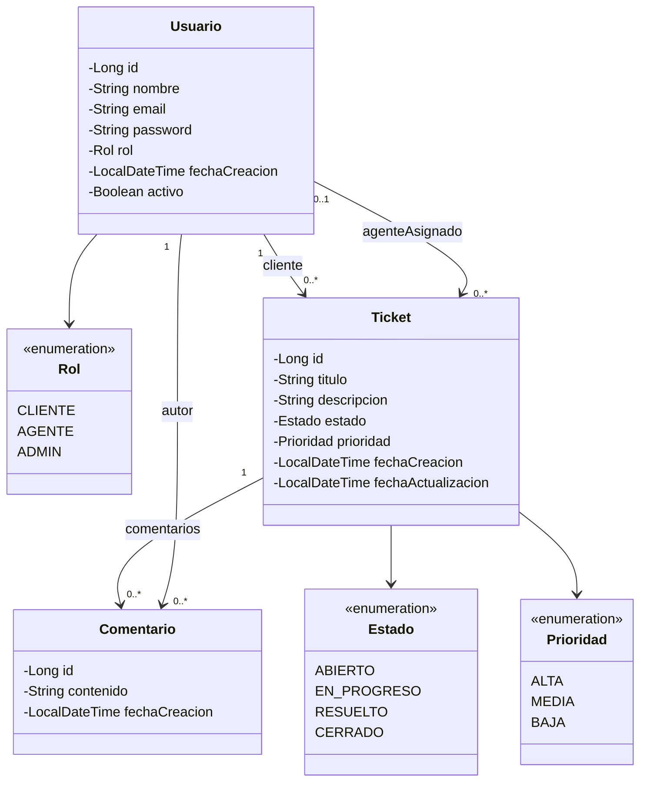
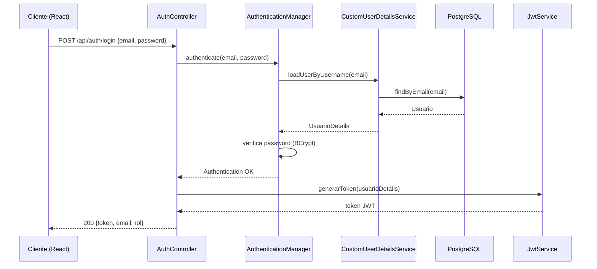
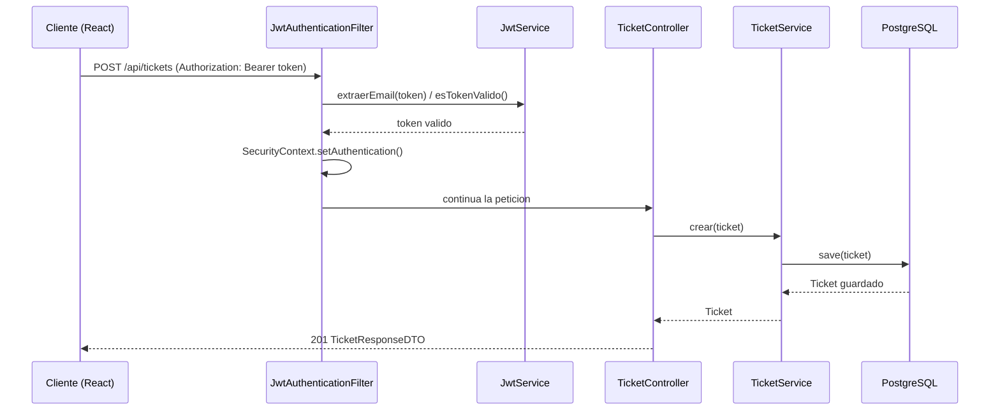
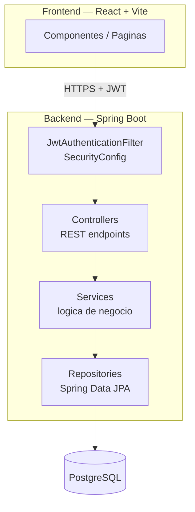
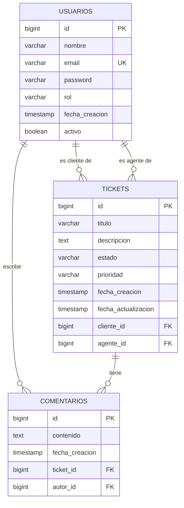
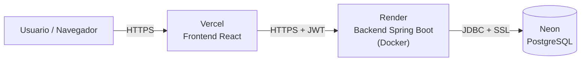

# Arquitectura técnica

## Diagrama de clases (UML)

Modelo de dominio: relación entre `Usuario`, `Ticket` y `Comentario`.

## Diagrama de secuencia: autenticación (login + JWT)

## Diagrama de secuencia: petición protegida (crear ticket)

## Arquitectura en capas

## Modelo entidad-relación

## Diagrama de despliegue

